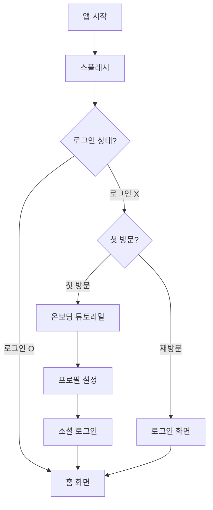

# 온보딩 화면 와이어프레임

> **화면명:** 온보딩 (Onboarding)  
> **파일 위치:** `lib/presentation/pages/splash/`, `lib/presentation/pages/onboarding/`

---

## 1. 스플래시 화면 (Splash Screen)

### 1.1 레이아웃

```
┌─────────────────────────────────────┐
│                                     │
│                                     │
│                                     │
│           ┌─────────┐              │
│           │   🧭    │              │
│           │ (나침반) │              │
│           └─────────┘              │
│                                     │
│          TradeWinds                 │
│                                     │
│    "새로운 항해를 시작합니다"         │
│                                     │
│         ════════════               │
│         (로딩 바)                   │
│                                     │
│                                     │
└─────────────────────────────────────┘
```

### 1.2 컴포넌트 상세

| 요소 | 타입 | 스타일 | 동작 |
|------|------|--------|------|
| 나침반 로고 | AnimatedWidget | 120x120, 회전 애니메이션 | 3초간 회전 |
| 앱 이름 | Text | Playfair Display, 32pt, Gold | - |
| 슬로건 | Text | Noto Sans KR, 14pt, Wood | 페이드인 |
| 로딩 바 | LinearProgressIndicator | Gold, 200px width | 3초 진행 |

### 1.3 동작 플로우

```
[앱 시작]
    ↓
[나침반 애니메이션 시작] (0.5s)
    ↓
[앱 이름 페이드인] (0.5s)
    ↓
[슬로건 페이드인] (0.5s)
    ↓
[로딩 진행] (1.5s)
    ↓
[인증 상태 확인]
    ├── 로그인 O → 홈 화면
    └── 로그인 X → 온보딩 화면
```

### 1.4 배경

- **색상:** Primary Dark (#0F2942)에서 Primary (#1A365D)로 그라데이션
- **효과:** 미세한 파도 패턴 오버레이 (투명도 5%)

---

## 2. 온보딩 튜토리얼 (3페이지)

### 2.1 공통 레이아웃

```
┌─────────────────────────────────────┐
│                              [건너뛰기]│
│                                     │
│         ┌─────────────────┐        │
│         │                 │        │
│         │   일러스트/     │        │
│         │   이미지 영역    │        │
│         │   (280x280)     │        │
│         │                 │        │
│         └─────────────────┘        │
│                                     │
│           [제목 텍스트]              │
│                                     │
│         [설명 텍스트 영역]           │
│         최대 2줄까지 표시            │
│                                     │
│           ○ ● ○                    │
│         (페이지 인디케이터)          │
│                                     │
│    ┌─────────────────────────┐     │
│    │       [다음/시작하기]     │     │
│    └─────────────────────────┘     │
│                                     │
└─────────────────────────────────────┘
```

### 2.2 페이지별 콘텐츠

#### 페이지 1: 세계관 소개

| 요소 | 내용 |
|------|------|
| 이미지 | 세계 지도 + 배 일러스트 |
| 제목 | "디지털 대항해시대" |
| 설명 | "전 세계 145개 항구에서 발견되는 혁신적인 보물을 찾아 떠나세요" |

#### 페이지 2: 핵심 기능 - 탐험

| 요소 | 내용 |
|------|------|
| 이미지 | 지도 + 보물 상자 일러스트 |
| 제목 | "보물을 발견하세요" |
| 설명 | "킥스타터, 인디고고, 마쿠아케... 전 세계 펀딩 제품을 한 곳에서" |

#### 페이지 3: 핵심 기능 - 성장

| 요소 | 내용 |
|------|------|
| 이미지 | 선장 + 훈장 일러스트 |
| 제목 | "선장으로 성장하세요" |
| 설명 | "항해를 거듭할수록 등급이 올라가고 특별한 혜택이 기다립니다" |

### 2.3 인터랙션

```dart
// 제스처
- 좌우 스와이프: 페이지 이동
- 다음 버튼: 다음 페이지 / 마지막 페이지에서 프로필 설정으로

// 애니메이션
- 페이지 전환: SlideTransition (300ms)
- 인디케이터: 크기 변화 (활성: 24px, 비활성: 8px)
```

---

## 3. 선장 프로필 설정

### 3.1 레이아웃

```
┌─────────────────────────────────────┐
│ ←                                   │
│                                     │
│        "선장님의 정보를 알려주세요"    │
│                                     │
│         ┌─────────────┐            │
│         │             │            │
│         │   [아바타]   │  ← 탭하여 변경│
│         │   선택 영역   │            │
│         │             │            │
│         └─────────────┘            │
│                                     │
│    ┌───────────────────────────┐   │
│    │ 닉네임을 입력하세요          │   │
│    └───────────────────────────┘   │
│    * 2-12자, 특수문자 불가          │
│                                     │
│                                     │
│                                     │
│                                     │
│    ┌─────────────────────────┐     │
│    │     항해 시작하기         │     │
│    └─────────────────────────┘     │
│                                     │
└─────────────────────────────────────┘
```

### 3.2 아바타 선택 바텀시트

```
┌─────────────────────────────────────┐
│ ─────                               │
│                                     │
│         아바타를 선택하세요           │
│                                     │
│   ┌───┐ ┌───┐ ┌───┐ ┌───┐ ┌───┐   │
│   │🧔│ │👨│ │👩│ │🧑│ │👴│   │
│   └───┘ └───┘ └───┘ └───┘ └───┘   │
│                                     │
│   ┌───┐ ┌───┐ ┌───┐ ┌───┐ ┌───┐   │
│   │🏴‍☠️│ │⚓│ │🚢│ │🧭│ │🦜│   │
│   └───┘ └───┘ └───┘ └───┘ └───┘   │
│                                     │
│    ┌─────────────────────────┐     │
│    │         선택 완료         │     │
│    └─────────────────────────┘     │
└─────────────────────────────────────┘
```

### 3.3 유효성 검사

| 필드 | 규칙 | 에러 메시지 |
|------|------|------------|
| 닉네임 | 2-12자 | "닉네임은 2자 이상 12자 이하로 입력해주세요" |
| 닉네임 | 특수문자 불가 | "특수문자는 사용할 수 없습니다" |
| 닉네임 | 중복 확인 | "이미 사용 중인 닉네임입니다" |
| 아바타 | 필수 선택 | "아바타를 선택해주세요" |

---

## 4. 색상 및 스타일 가이드

### 4.1 온보딩 전용 색상

```dart
// 배경
backgroundColor: AppColors.parchment  // #FAF5E4

// 텍스트
titleColor: AppColors.primary         // #1A365D
descriptionColor: AppColors.textSecondary  // #4A5568

// 버튼
buttonBackground: AppColors.gold      // #D69E2E
buttonText: AppColors.textOnGold      // #1A202C

// 인디케이터
activeIndicator: AppColors.gold       // #D69E2E
inactiveIndicator: AppColors.parchmentDark  // #E8DCC4
```

### 4.2 컴포넌트 스타일

```dart
// 건너뛰기 버튼
TextButton(
  style: TextStyle(
    color: AppColors.textTertiary,
    fontSize: 14,
  ),
)

// 다음 버튼
ElevatedButton(
  style: ElevatedButton.styleFrom(
    backgroundColor: AppColors.gold,
    foregroundColor: AppColors.textOnGold,
    minimumSize: Size(double.infinity, 56),
    shape: RoundedRectangleBorder(
      borderRadius: BorderRadius.circular(12),
    ),
  ),
)

// 닉네임 입력 필드
TextField(
  decoration: InputDecoration(
    filled: true,
    fillColor: Colors.white,
    border: OutlineInputBorder(
      borderRadius: BorderRadius.circular(12),
      borderSide: BorderSide(color: AppColors.parchmentDark),
    ),
    focusedBorder: OutlineInputBorder(
      borderSide: BorderSide(color: AppColors.gold, width: 2),
    ),
  ),
)
```

---

## 5. 네비게이션 플로우



---

## 6. 애니메이션 명세

| 화면 | 애니메이션 | 속성 |
|------|-----------|------|
| 스플래시 | 나침반 회전 | `RotationTransition`, 1회전/3초 |
| 스플래시 | 텍스트 페이드인 | `FadeTransition`, 500ms |
| 온보딩 | 페이지 전환 | `PageView`, curve: easeInOut |
| 온보딩 | 이미지 등장 | `SlideTransition` + `FadeTransition` |
| 프로필 | 아바타 선택 | `ScaleTransition`, 200ms |

